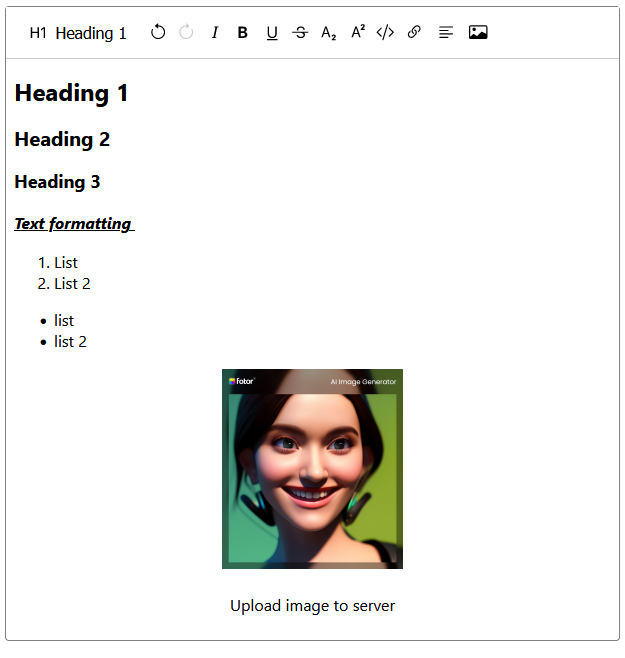

# Text Editor Ready to use

> Currently on heavy development. Use at your own risk.

## What is it?

This is a simple text editor that is ready to use. It is written in Reactjs and uses [Lexical](https://lexical.dev/) as the text editor framework

## Feature

- Text formatting : Bold, italic, underline, and etc.
- Text alignment : Left, center, and right
- Code
- Image
  - Upload to server
  - draggable
  - upload using drag and drop from local



## Run preview

```bash
yarn install
npx nx serve preview
```